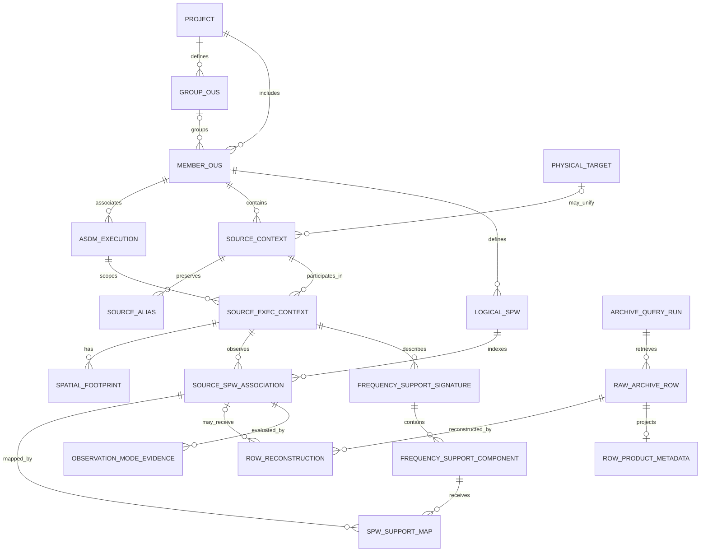
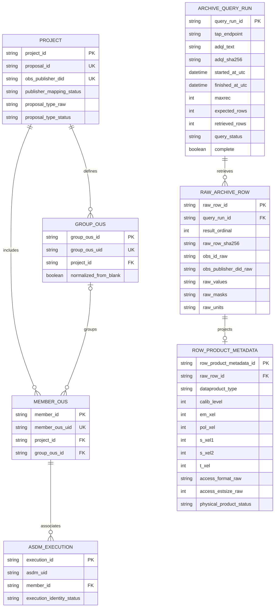
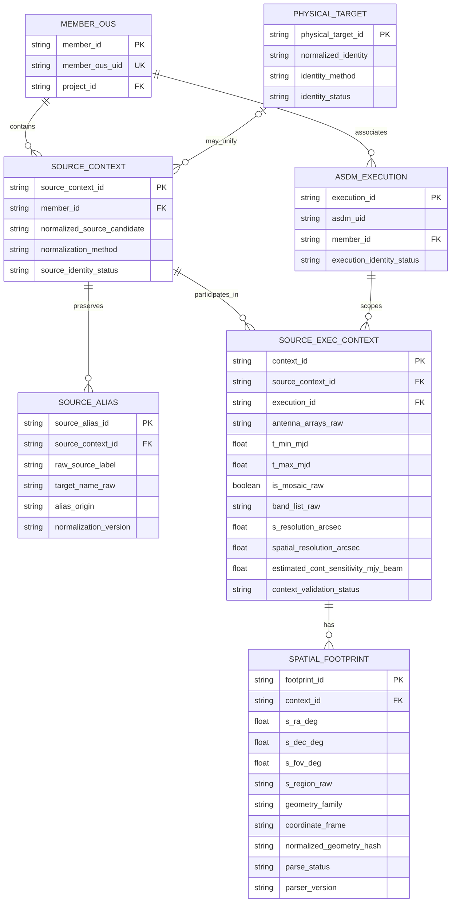
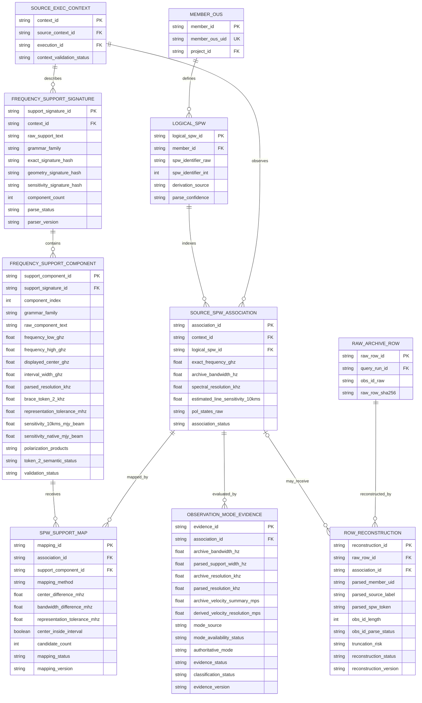

# Internal Archive and Queue Reconstruction Model v0.6

## Status and scope

This document defines the evidence-based internal representation of both the
current public ALMA `ivoa.obscore` TAP view and the current-cycle Queue CSV.
The Archive component follows Notebooks 01, 02, 02b, 03, 04, 04b, and 04c;
the Queue component follows Notebook 05 and its versioned ingestion contract.

It is not the official internal ALMA database schema. It is an application
model for preserving Archive evidence, reconstructing relationships needed by
the duplication-checking tool, and isolating later comparison policy from raw
metadata.

Notebook 04b closed the Archive-structure exploration phase using a
2026-08-25 snapshot with 442,507 science-target rows and 73 live columns.
Notebook 04c closed the current semantic-review phase using a
2026-08-31 snapshot with 443,211 science-target rows and the same 73-column
`ivoa.obscore` schema. Later Archive-wide censuses and explicit
counterexamples supersede earlier sample statements wherever they conflict;
counts from different capture times are never combined as one snapshot.

The production Archive client v2 implements query construction,
COUNT/retrieval reconciliation, query-status handling, schema-name checks,
query provenance, an incomplete-result pipeline gate, and ordered retrieval
field-metadata preservation (`name`, datatype, arraysize, unit, UCD, utype,
xtype, and description), including valid zero-row responses.

The production Queue CSV v1 implementation fingerprints the exact byte
snapshot with SHA-256 and byte length, and preserves its embedded dictionary,
mixed secondary-header row, all 79 raw operational values, source-line
identity, both unit representations, typed row evidence, and observed
spatial-spectral-request associations. It does not retain the complete source
byte content inside `QueueSnapshot`, infer missing Cartesian relationships, or
apply policy decisions.

## Evidence summary

| Question | Current evidence | Model consequence |
|---|---|---|
| Live schema | 73 columns; schema SHA-256 `2cb2009067ab50f1727454ccb57cb1280c81ad4bfa3a10a9c2df2f0de7044c15` | Classify all fields and detect future schema drift |
| Science-target population | 442,507 rows on 2026-08-25 and 443,211 rows at `2026-08-31T12:27:55.081125+00:00` | Treat all counts as time-specific snapshots and preserve capture provenance |
| Query completeness | COUNT/retrieve reconciliation, valid empty result, and intentional `OVERFLOW` verified | Never infer absence from an incomplete response |
| Retrieval field metadata | PyVO exposes VOTable `FIELD` descriptors independently of result rows; the v2 runtime contract preserves them in projection order | Carry units and semantic descriptors with the same query result, including valid empty results |
| Comparison-field units | Live units for frequency, bandwidth, spectral/spatial resolution, and two sensitivity estimates are checked at runtime | Convert only compatible units; preserve missing/incompatible status rather than assuming units from names |
| Query arithmetic units | Frequency ADQL assumes `frequency=GHz`, `bandwidth=Hz`; angular ADQL assumes `spatial_resolution=arcsec` | Verify exact `TAP_SCHEMA` units for each requested numeric prefilter, disable unsafe filters independently, retain original bounds in provenance, and keep NULL evidence rows for local non-evaluability |
| Archive frequency frame | Public documentation identifies sky frequency but not a comparison-ready TAP reference frame | Derive typed Archive coverage but keep cross-source frame alignment unavailable |
| `obs_publisher_did` | 5,611 proposal IDs and 5,611 publisher DIDs; exact `ADS/JAO.ALMA#<proposal_id>` mapping with no exception | Project-level external identifier, not a row or product key |
| `obs_id` | 442,141 parsed; 366 width-truncated failures; 275 additional parseable values at the 64-character boundary | Preserve raw value and parse confidence; never use as an Archive-wide key |
| Row identity | 134 duplicate `obs_id` groups; 42 duplicate parsed Source-Execution-SPW groups, all affected by identifier-width risk | Use internal surrogate row identifiers |
| Source-SPW cardinality | 39 complete grids and one explicit sparse association in the expanded census | Store observed associations; never synthesize a Cartesian grid |
| Support mapping | One context mapped 7 SPW rows to 4 support components | Allow many SPWs to map to one support component |
| Frequency-support grammar | 442,452 bracket rows, 55 brace rows, no missing/blank/unknown top-level family | Dispatch by grammar family and preserve unknown fallback |
| Brace population | Complete 55/55-row census; all structures and mappings valid | Support brace grammar in production; retain token-2 semantic ambiguity |
| Repeated source across ASDM | Spatially verified `3C279`/`3c279` case across two ASDMs | Keep footprint, time, antenna, support, and resolution at Source-Execution scope |
| STC-S family | 194,500 CIRCLE, 245,655 POLYGON, 2,352 UNION; no missing/blank/unknown | Support three current top-level families; retain raw geometry |
| Product population | 305,618 cube and 136,889 image rows, all `calib_level=2` | Treat product metadata as row evidence; physical file granularity remains unresolved |
| Spatial resolution | 41,365 of 442,507 rows had `s_resolution != spatial_resolution` | Preserve the two fields separately |
| Primary angular-resolution evidence | Service definitions differ; official ALMA query examples use `spatial_resolution` | Use `spatial_resolution` for initial Archive candidate retrieval, preserve `s_resolution` as a cross-check, and treat neither as a measured FITS restoring beam |
| Top-level `type` | Eight values were observed on 2026-08-31; all 5,614 distinct proposal/type pairs matched the terminal `proposal_id` suffix | Model as optional proposal/project classification with an unknown-value fallback; do not confuse `type = 'T'` with `science_observation = 'T'` |
| Frequency-Support mode | Standard `continuum`, `line`, `FDM`, and `TDM` literals each matched zero of 443,211 science-target `frequency_support` strings; no separate mode column was identified among the 73 `ivoa.obscore` columns | Keep an explicit representation gap; do not infer FDM/TDM from top-level `type`, bandwidth, or resolution |
| Sensitivity semantics | TAP metadata defines continuum and nominal 10 km/s sensitivity as estimates with documented limitations | Store separate estimated-evidence concepts; never label them achieved QA2 product RMS |
| QA2 boundary | Archive metadata may be available after QA0 while processing or QA2 remains incomplete | Keep `qa2_passed` as evidence and leave inclusion/exclusion to explicit policy |
| Reconstruction determinism | Five shuffle seeds produced identical reconstructions | Require order-independent production reconstruction |

## Modeling principles

1. Preserve complete raw TAP rows, units, masks, identifiers, and query
   provenance before parsing.
2. Use internal surrogate identifiers. No current Archive field is accepted as
   an Archive-row primary key.
3. Separate Project, Member OUS, ASDM execution, source identity,
   Source-Execution context, logical SPW, and raw Archive row.
4. Store only observed Source-Execution-SPW associations. Never generate
   absent rows through a Cartesian product.
5. Separate raw, parsed, normalized, and policy-level values.
6. Attach parse status, validation status, algorithm version, and uncertainty
   to every derived value.
7. Preserve both representations when Archive fields are related but not
   interchangeable.
8. Keep duplication thresholds and decisions outside the Archive
   reconstruction layer.
9. Distinguish service-exposed values from semantics documented only for the
   Archive Web representation. A documented field is not ingested unless a
   stable supported programmatic representation is identified.
10. Treat sensitivity and angular-resolution summaries as Archive evidence,
    not achieved FITS-product measurements.
11. Keep analytical Queue grouping separate from row-level comparison
    identity; only `QueueRowAssociation` preserves an observed combination.

## Entity-relationship model

The diagrams below describe one conceptual model. The first diagram gives the
complete cardinality overview. The following diagrams repeat selected
relationships and add implementation attributes so that the model remains
readable in Markdown. Attribute types are logical types, not final SQL DDL.

### Complete relationship overview



Cardinality notation:

| Marker | Meaning |
|---|---|
| `||` | exactly one |
| `o|` | zero or one |
| `|{` | one or many |
| `o{` | zero or many |

The marker next to an entity states how many instances of that entity may be
related to one instance at the opposite end.

### Project, dataset, and raw-query provenance



`ROW_PRODUCT_METADATA` is a normalized projection of optional ObsCore fields,
not a claim that a physical product or downloadable file has been identified.
`PROJECT` uniqueness constraints apply to the current normalized snapshot;
the raw values still remain in `RAW_ARCHIVE_ROW` and are revalidated on ingest.

### Source, execution, alias, and footprint context



The repeated-source counterexample requires `SPATIAL_FOOTPRINT` and the other
varying fields to hang from `SOURCE_EXEC_CONTEXT`, not directly from
`SOURCE_CONTEXT`. `PHYSICAL_TARGET` remains optional and must not collapse raw
aliases or execution evidence.

### Spectral structure, support parsing, and row reconstruction



This is the central engineering distinction in v0.4:

- `SOURCE_SPW_ASSOCIATION` represents an observed logical association;
- `RAW_ARCHIVE_ROW` preserves one returned TAP row;
- `ROW_RECONSTRUCTION` records whether and how that row supports an
  association;
- `SPW_SUPPORT_MAP` maps the association to parsed support components; and
- `OBSERVATION_MODE_EVIDENCE` stores versioned cross-checks without turning a
  heuristic mode classification into identity.

This separation permits parse failures, 64-character identifier truncation,
sparse Source-SPW associations, multiple raw rows supporting one association,
and multiple SPWs mapping to one support component. It does not assert that
multiple physical products or files have been proven.

## Entity definitions

### `PROJECT`

Represents the proposal/project scope exposed by the Archive.

Required attributes:

- internal `project_id`;
- raw `proposal_id`;
- raw `obs_publisher_did`;
- publisher/proposal mapping status.

In the closure snapshot, `proposal_id` and `obs_publisher_did` formed a
one-to-one mapping, and every publisher DID equalled
`ADS/JAO.ALMA#<proposal_id>`. The publisher DID is an alternate external
Project identifier, not a product or row identifier.

Top-level TAP `type` is optional Project-classification evidence. In the
2026-08-31 census, all 5,614 distinct proposal/type pairs matched the terminal
`proposal_id` suffix, with current values `S`, `L`, `T`, `V`, `SV`, `E`, `P`,
and `CAL`. The model treats this as an open value set and preserves unknown
future values. It is unrelated to `science_observation = 'T'` and must never
be used as an FDM/TDM label. The production v2 retrieval projection does not
need this field for reconstruction.

### `GROUP_OUS`

Optional grouping entity. Blank `group_ous_uid` values are normalized to
missing in the reconstructed model while the raw blank remains in
`RAW_ARCHIVE_ROW`.

### `MEMBER_OUS`

Outer independently processable dataset container identified by
`member_ous_uid`. A Member may contain multiple sources, SPWs, ASDM
associations, footprints, mosaic states, and support signatures. A Member is
not one observation, execution, product, or Archive row.

### `ASDM_EXECUTION`

Preserves `asdm_uid` and execution-related provenance. One Member may
associate with multiple ASDMs. The model does not claim that the public view
exposes the complete official execution schema.

### `SOURCE_CONTEXT` and `SOURCE_ALIAS`

`SOURCE_CONTEXT` is an internal source identity within a Member. It preserves
raw labels without claiming global physical-target identity. A provisional
reconstruction key is:

```text
(member_ous_uid, normalized source candidate)
```

`SOURCE_ALIAS` preserves every raw spelling and normalization method. Source
normalization alone is insufficient for physical identity; coordinates and
execution context must also be considered.

### `SOURCE_EXEC_CONTEXT`

Conservative context defined by:

```text
(member_ous_uid, asdm_uid, source_context_id)
```

It owns metadata demonstrated to vary for the same normalized source across
ASDMs, including:

- footprint and representative coordinates;
- time bounds;
- antenna configuration;
- raw frequency-support signature;
- mosaic state;
- separate `s_resolution` and `spatial_resolution` evidence; and
- estimated aggregate continuum-sensitivity evidence.

`spatial_resolution` is the primary Archive field for initial angular-
resolution candidate retrieval. `s_resolution` remains an independent
ObsCore cross-check. Neither value is modeled as a measured FITS restoring
beam.

### `SPATIAL_FOOTPRINT`

Execution-scoped spatial evidence containing:

- raw `s_region`;
- `s_ra`, `s_dec`, and `s_fov`;
- geometry family and coordinate frame;
- raw mosaic state;
- parser/validation status;
- footprint hash when derived.

Current top-level STC-S families are CIRCLE, POLYGON, and UNION, all observed
with ICRS in structural samples. ObsCore exposes aggregate footprints; it does
not demonstrate individual mosaic pointing identities.

### `LOGICAL_SPW`

Parsed SPW candidate scoped to a Member. SPW collections are variable length.
The raw token, parsing confidence, and derivation method are required because
`obs_id` can be truncated at 64 characters.

### `SOURCE_SPW_ASSOCIATION`

Explicit bridge between one Source-Execution context and one Logical SPW
candidate. It replaces the earlier assumption that Archive rows always form a
complete Source × SPW grid.

It may contain comparison-relevant row evidence such as:

- exact frequency;
- Archive bandwidth;
- spectral resolution;
- estimated nominal 10 km/s line sensitivity;
- polarization evidence;
- reconstruction confidence.

No missing association may be synthesized from Member-level SPW inventory.

### `FREQUENCY_SUPPORT_SIGNATURE`

Preserves one complete raw `frequency_support` string at Source-Execution
scope, with:

- top-level grammar family;
- exact raw-string hash;
- optional spectral-geometry and sensitivity hashes;
- component count;
- parse and validation status;
- parser version.

### `FREQUENCY_SUPPORT_COMPONENT`

Polymorphic parsed component. Common fields include raw component text,
component index, sensitivity values, polarization products, and validation
status.

Bracket-specific fields:

- lower and upper frequency;
- interval centre and width;
- parsed resolution.

Brace-specific fields:

- displayed centre frequency;
- representation tolerance derived from decimal precision;
- raw token 2 and normalized kHz value;
- token-2 semantic status.

For the complete current brace population, token 2 was numerically equal to
both spectral resolution and total bandwidth after unit conversion because
`em_xel=1`. Its semantic status therefore remains
`AMBIGUOUS_BANDWIDTH_VS_RESOLUTION_NUMERICAL_DEGENERACY`.

### `SPW_SUPPORT_MAP`

Versioned derived mapping between a Source-SPW association and a support
component. Attributes include:

- mapping method;
- centre and bandwidth differences;
- representation tolerance;
- containment candidates;
- ambiguity and validation status.

The relationship is not one-to-one. One support component may receive multiple
SPW mappings.

### `OBSERVATION_MODE_EVIDENCE`

Versioned comparison evidence attached to a Source-SPW association. It keeps
Archive values and parser-derived values side by side, including bandwidth,
spectral resolution, and velocity-resolution representations. It records an
evidence status and an optional classification status, but it is not an
identity entity and must not turn an FDM/TDM heuristic into an authoritative
Archive fact.

The Cycle 13 Archive Manual documents a nested Frequency Support Type where
`continuum` maps to TDM and `line` maps to FDM. Notebook 04c found neither
those literals nor `TDM`/`FDM` in any of the 443,211 current science-target
`frequency_support` strings, and no separate correlator-mode column among the
73 current `ivoa.obscore` columns. Therefore mode-source and availability
status are required even when the authoritative mode value is absent. No mode
may be inferred solely from top-level `type`, bandwidth, or resolution.

### `ARCHIVE_QUERY_RUN`

Records endpoint, ADQL, normalized parameters, start/end time, MAXREC,
expected count, retrieved count, `QUERY_STATUS`, warnings, completeness, and
query hash. A response with `OVERFLOW`, a count mismatch, or an execution error
must never support a negative duplication conclusion.

The v2 client preserves the selected column-name schema and an ordered
retrieval field-metadata snapshot containing name, datatype, arraysize, unit,
UCD, utype, xtype, and description. It retains descriptors even when the
retrieval contains zero rows and links them to the same query result and
capture provenance. Descriptor names must match declared columns in order.

### `RAW_ARCHIVE_ROW`

Immutable evidence record with an internal surrogate `raw_row_id`. It
preserves all original TAP values, masks, units, identifiers, result order,
and a content hash. It is linked to the exact `ARCHIVE_QUERY_RUN` that
retrieved it. Parsing never overwrites this entity.

Service-unit and field-description evidence now remains available through the
v2 runtime result and therefore through `ArchivePipelineBatch.query_result`.
Normalization and parsing do not overwrite descriptor text. Durable storage
must later serialize the tuple without changing its order or optional `None`
values. The v0.6 Archive adapter validates the six comparison-facing units,
converts compatible source units into canonical values, and preserves
missing/incompatible states. The future shared Archive/Queue adapter must use
this typed projection rather than recasting raw row values. Archive
reconstruction already consumes the canonical typed `frequency` value, so a
compatible TAP unit change cannot split comparison evidence from
frequency-support mapping. Comparison quantities must be finite and strictly
positive, and frequency coverage is unavailable unless its canonical bounds
satisfy `0 < lower < upper`.

### `ROW_PRODUCT_METADATA`

Optional normalized projection of row-level ObsCore product metadata such as
`dataproduct_type`, `calib_level`, axis sizes, access format, and estimated
size. It exists to make optional fields queryable without naming the row a
physical product. The current public view does not expose a reliable file or
product identifier, and entirely NULL fields remain valid values in the raw
row.

Recommended `obs_id` confidence states:

```text
PARSED_BELOW_DECLARED_WIDTH
PARSED_AT_DECLARED_WIDTH_TRUNCATION_POSSIBLE
FAILED_AT_DECLARED_WIDTH_TRUNCATION_LIKELY
FAILED_OTHER
```

### `ROW_RECONSTRUCTION`

Versioned reconstruction attempt for a raw row. An attempt may remain
unlinked from any Source-SPW association when parsing is unsafe; later parser
versions can create additional attempts without mutating earlier evidence.
Multiple raw rows may link to one association without claiming that physical
product multiplicity has been resolved. Reconstruction diagnostics include:

- raw `obs_id` length;
- parsed Member, source, and SPW candidates;
- parse status and issue codes;
- declared-width truncation risk;
- reconstruction algorithm version and confidence.

### `PHYSICAL_TARGET`

Optional future application entity for alias resolution. It must never replace
raw source labels, coordinates, footprints, or execution provenance. Moving
and Solar-system targets require dedicated logic.

## Key and cardinality rules

### Enforced application rules

- Every raw Archive row has an internal surrogate key.
- Every derived entity records its source row(s), algorithm version, and
  status.
- Member, Source-Execution, and Source-SPW collections are variable length.
- Source-SPW associations are explicit and may be sparse.
- Support-component mappings may be many-to-one from SPWs to components.
- Raw values survive parse and validation failures.

### Forbidden assumptions

- `obs_id` is Archive-wide unique.
- `obs_publisher_did` identifies a row, product, Member, ASDM, source, SPW, or
  file.
- Archive rows equal `sources × member SPWs`.
- Support-component order is an official SPW identifier.
- One support component maps to at most one SPW.
- `s_resolution` and `spatial_resolution` are aliases.
- top-level TAP `type` is an observation-mode or FDM/TDM field.
- FDM/TDM can be inferred authoritatively from bandwidth or spectral
  resolution alone.
- Archive sensitivity summaries are achieved QA2 image-product RMS values.
- `spatial_resolution` is a measured FITS restoring beam.
- `qa2_passed = 'T'` is an ingestion-layer requirement.
- One ObsCore row equals one physical downloadable file.
- A Polygon necessarily means mosaic, or a mosaic necessarily uses one
  geometry family.

## Field ownership used by implementation

| Field/value | Model scope | Engineering treatment |
|---|---|---|
| `proposal_id`, `obs_publisher_did` | Project | Preserve raw; validate current one-to-one mapping |
| top-level `type` | Optional Project classification | Preserve raw and unknown values; validate against proposal suffix only as diagnostic evidence; never use as observation mode |
| `group_ous_uid` | Optional Group OUS | Normalize blank to missing; retain raw |
| `member_ous_uid` | Member OUS | Primary dataset grouping identifier |
| `asdm_uid` | ASDM execution | Retain in Source-Execution scope |
| Source parsed from `obs_id` | Source Context/Alias | Store parse confidence and raw label |
| `s_ra`, `s_dec`, `s_fov`, `s_region`, `is_mosaic` | Spatial Footprint at Source-Execution scope | Preserve raw STC-S and geometry family |
| `frequency_support` | Source-Execution Context | Grammar-dispatched, raw-preserving parser |
| `antenna_arrays`, `t_min`, `t_max` | Source-Execution Context | Preserve raw execution evidence |
| `cont_sensitivity_bandwidth` | Source-Execution Context | Estimated aggregate continuum evidence; not achieved product RMS |
| Parsed SPW, `frequency`, `bandwidth` | Source-SPW Association/raw row | Preserve exact values and units |
| `spectral_resolution`, `sensitivity_10kms` | Source-SPW Association/raw row | SPW-sensitive evidence; sensitivity is an estimate at nominal 10 km/s, not achieved product RMS |
| Parsed support component | Frequency-Support Component | Versioned derived metadata |
| `s_resolution`, `spatial_resolution` | Separate Source-Execution/raw evidence | Use `spatial_resolution` for initial Archive candidate retrieval; retain `s_resolution` as a cross-check; never merge or impose equality |
| `qa2_passed` | Raw QA evidence / later policy | Normalize known values but do not apply as an implicit client filter |
| documented nested Frequency Support Type | Observation-mode availability evidence | Currently not exposed by `ivoa.obscore`; do not fabricate or infer; preserve representation-gap status |
| `em_min`, `em_max`, `em_resolution`, `velocity_resolution` | Cross-check/derived evidence | Tolerance-aware validation only |
| Axis and access metadata | Optional row/product metadata | Never required for core reconstruction |
| Duplication result | Policy layer | Not part of this model |

## Numerical and normalization rules

- Compare frequencies only after explicit unit conversion.
- Use an explicit tolerance for wavelength/frequency boundary conversions;
  direct binary floating-point equality is not a quality test.
- Preserve Archive bandwidth and parsed support width separately.
- Preserve `s_resolution` and `spatial_resolution` separately.
- Preserve line, native-resolution, and aggregate continuum sensitivities as
  distinct estimated-evidence concepts; do not label them achieved QA2 RMS.
- Treat `spatial_resolution` as approximate Archive angular-resolution
  evidence and `s_resolution` as a separate cross-check; neither is a measured
  FITS restoring beam.
- Normalize blank optional identifiers to missing while retaining raw values.
- Treat `3000-01-01` release dates as an observed sentinel state, not a real
  release date.
- Make reconstruction deterministic under input-row shuffling.

## Evidence levels

The implementation and documentation use four evidence levels:

1. `SERVICE_DEFINED`: field names, types, units, and descriptions from the
   live TAP schema.
2. `ARCHIVE_WIDE_CENSUS`: complete current-snapshot row counts or mappings.
3. `COMPLETE_CURRENT_POPULATION`: complete validation of a bounded current
   population, such as all 55 brace rows.
4. `SAMPLE_SUPPORTED` or `COUNTEREXAMPLE`: purposive evidence. A
   counterexample is sufficient to reject a universal constraint but not to
   estimate prevalence.

## Archive production implementation contract

1. Ingest raw rows before reconstruction.
2. Count and retrieve with completeness reconciliation.
3. Reject negative conclusions from incomplete queries.
4. Use surrogate identifiers and preserve every Archive identifier.
5. Dispatch `frequency_support` by grammar family and retain unknown fallback.
6. Store only observed Source-SPW associations.
7. Attach footprint and execution metadata to Source-Execution context.
8. Version parsers, unit conversions, mappings, normalization, and policy.
9. Surface parse, truncation, ambiguity, and mapping statuses to callers.
10. Keep candidate retrieval, reconstruction, and duplication assessment as
    separate layers.
11. Keep Project classification, science-row role, and observation mode as
    separate concepts.
12. Preserve QA2 state as evidence; apply any QA2 inclusion rule only in an
    explicit, versioned policy layer.
13. Preserve ordered TAP field metadata with each retrieval result and use
    explicit, tested adapters for any unit conversion.

Required automated tests include malformed identifiers, 63/64/65-character
boundaries, bracket and brace parsing, sparse associations, many-to-one
support mapping, masked values, sentinel dates, numerical tolerance, TAP
overflow, valid empty results, schema drift, and shuffle invariance.

## Queue reconstruction extension v1

The Queue source has no stable Science Goal, Scheduling Block, or spectral
setup identifier in the public CSV. Its reconstruction keys are therefore
versioned internal signatures scoped by:

```text
(Project Code, Target Name, Band)
```

That scope is an analytical grouping key, not a claim of official ALMA entity
identity.

| Queue object | Ownership and safety rule |
|---|---|
| `QueueSnapshot` | Owns source URL, checksum, capture time, description, dictionary, operational header, secondary header, schema version, and parser version |
| `RawQueueRow` | Owns the exact 79 raw strings, physical line range, source ordinal, and content fingerprint; identical content on different lines remains distinct |
| `QueueRowInput` | Typed projection of one valid raw row; never replaces the raw row |
| `QueueSpatialComponent` | Factored coordinates, offsets, mosaic classification, rectangle geometry, coordinate system, and `1e-6 arcsec` classification tolerance |
| `QueueSpectralSetup` | Tagged union of complete numbered SPWs or one SPS range, including velocity context, requested sensitivity basis, raw/canonical units, nominal bandwidth, portal-script-derived usable-bandwidth evidence, derivation kind, pending processor-scope status, and frequency-derivation provenance |
| `QueueRequestContext` | Requested angular resolution, LAS, arrays, and polarization |
| `QueueRowAssociation` | The one spatial-spectral-request relationship actually observed in one source row |
| `QueueFactorizationSummary` | Reports observed versus potential spatial-spectral pairs without creating the missing pairs |

The 48 numbered SPW columns are physically ordered as 16 frequencies, then
16 bandwidths, then 16 resolutions. They are logically reconstructed only as
same-number triples:

```text
SPW N = Freq SPW N
      + Bandwidth SPW N
      + Spec.Res. SPW N
```

A partial triple is an ingestion error. Empty higher slots remain empty; a
non-contiguous population is preserved with a warning rather than silently
renumbered.

Queue quantities retain `raw_text`, `raw_value`, embedded-dictionary unit,
secondary-header unit, canonical value/unit, and a unit-interpretation status.
This is essential for `SPS Bandwidth`, whose current dictionary declares MHz
while the secondary header says GHz. The pinned data support a versioned MHz
interpretation, but both source declarations remain reachable.

Regular SPW frequencies are converted to Queue-side sky intervals using the
declared sky/rest flag and RADIO, OPTICAL, or RELATIVISTIC velocity convention.
The conversion version and raw velocity frame remain attached. This validates
Queue-internal coverage only; Archive/Queue frame alignment remains a later
comparison concern.

Production Queue reconstruction enforces these cardinality rules:

1. each complete input row yields exactly one observed association;
2. exact exported duplicates yield distinct associations with distinct source
   row identities;
3. spatial, spectral, and request entities may be factored only after the row
   association has been recorded;
4. absent spatial-spectral combinations are never synthesized; and
5. an incomplete parse cannot enter reconstruction.

The reduced CI fixture covers regular SPWs, SPS, custom and rectangle mosaics,
exact duplicates, and both known sparse groups. A separate opt-in acceptance
test validates the pinned 3,200-row snapshot, including 16,216 SPWs, 419
project-target-band groups, two sparse groups, and 65 excess exact copies.

## Explicitly deferred work

The following items do not block Archive-model v0.4:

- physical product/file granularity hidden by identifier-width limits;
- future and unobserved `frequency_support` grammars;
- brace token-2 semantic discrimination;
- full-population local STC-S parsing if local geometry is later required;
- physical-target alias resolution;
- individual mosaic pointing reconstruction;
- moving and Solar-system target handling;
- authoritative observation-mode/FDM/TDM classification;
- stable programmatic access to the documented nested Frequency Support Type;
- durable serialization of TAP field-metadata snapshots beyond the runtime
  query result;
- achieved image-product sensitivity and measured FITS restoring-beam
  evidence;
- primary-beam and spectral-smoothing policy;
- frequency, sensitivity, and spatial duplication thresholds;
- known-duplicate end-to-end validation.

These belong to parser tests, later notebooks, or the policy layer. Archive
structure exploration should remain closed unless a production failure exposes
a new grammar or cardinality counterexample.

## Semantic-source references

- [Cycle 13 ALMA Science Archive Manual](https://almascience.eso.org/documents-and-tools/cycle13/science-archive-manual)
- [ALMA query by spatial resolution](https://almascience.eso.org/alma-data/archive/archive-notebooks/nb5_ALMA_Query_by_spatial_resolution.html)
- [ALMA query by sensitivity](https://almascience.eso.org/alma-data/archive/archive-notebooks/nb7_ALMA_Query_by_sensitivity.html)
- [ALMA data resources](https://almascience.eso.org/alma-data)
- [ALMA processing resources](https://almascience.eso.org/processing)

These sources establish scientific semantics for the documented Archive
interface. They do not create fields that the current `ivoa.obscore`
representation does not expose, and they do not replace captured TAP values
as ingestion evidence.
