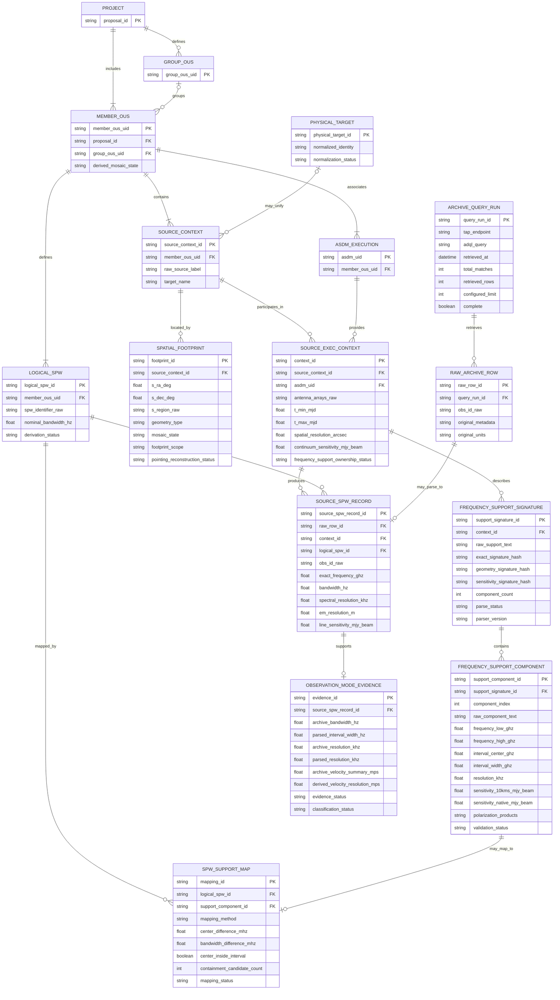

# Preliminary Internal Data Model v0.3

This document defines the preliminary normalized Archive representation used by
the ALMA duplication-checking tool after Notebooks 1, 2, 2b, 3, and 4.

It is not a reconstruction of ALMA's complete internal database schema. It
separates:

1. Archive query provenance;
2. complete raw TAP rows;
3. parsed identifiers and spectral metadata;
4. reconstructed Archive relationships;
5. normalized comparison-ready values;
6. future duplication-policy results.

Notebook 4 validated a conservative execution-aware Source-SPW structure,
resolved overlapping support intervals with a one-to-one mapping, distinguished
SPW-level from aggregate resolution and sensitivity fields, and established
that tested ObsCore mosaic metadata exposes aggregate footprints rather than
demonstrated individual pointings.

Sample-supported relationships are not automatically treated as Archive-wide
constraints. Raw values are never overwritten by parsed, derived, normalized,
or policy-level values.

## Modeling principles

1. **Preserve raw data before interpretation.** Original values, units,
   identifiers, missing values, query text, endpoint, and retrieval metadata
   remain available after parsing.
2. **Represent relationships explicitly.** Proposal, Group OUS, Member OUS,
   source, ASDM, footprint, SPW, and support-component relationships are not
   collapsed into one flat observation object.
3. **Separate identity from labels.** Raw source labels and `target_name` are
   retained but are not treated automatically as physical-target identifiers.
4. **Separate raw, parsed, derived, and normalized values.** Derived interval
   centres, widths, signatures, and mappings do not overwrite Archive fields.
5. **Permit uncertain cardinalities.** The model allows multiple sources,
   SPWs, ASDMs, footprints, and support signatures within one Member OUS.
6. **Separate reconstruction from policy.** Duplication thresholds and
   assessment results do not belong in the Archive reconstruction layer.

## Entity-relationship model

## Interpretation

The model separates the flattened Archive response into six layers.

### 1. Query and raw-data layer

`ARCHIVE_QUERY_RUN` records the endpoint, ADQL, normalized parameters,
retrieval limit, expected rows, retrieved rows, and completeness status.
`RAW_ARCHIVE_ROW` preserves the complete original TAP record. An incomplete
query response must never be treated as evidence that no additional candidate
exists.

A raw row receives an internal surrogate identifier. The original `obs_id` is
preserved as a candidate source identifier rather than enforced as an official
Archive-wide primary key.

### 2. Project and dataset hierarchy

`PROJECT`, optional `GROUP_OUS`, and `MEMBER_OUS` preserve the tested OUS
hierarchy. Member OUS is an outer dataset container, not one Archive row and not
necessarily one execution.

Empty `group_ous_uid` values are normalized as missing in the parsed model while
the raw value remains available in `RAW_ARCHIVE_ROW`.

### 3. Source, execution, and spatial context

`SOURCE_CONTEXT` preserves the source component parsed from `obs_id` together
with raw target metadata. The provisional natural key is:

`(member_ous_uid, parsed obs_id source)`

This is an internal reconstruction concept, not an official ALMA entity and not
a globally unique physical target.

`ASDM_EXECUTION` preserves execution-related provenance. `SOURCE_EXEC_CONTEXT`
represents the provisional association between a Source Context and an ASDM.
It conservatively stores fields whose final ownership cannot yet be separated
between source, execution, field, or observing configuration.

Notebook 4 supports `(member_ous_uid, asdm_uid, parsed source)` as the
conservative execution-aware context. All 376 tested contexts had equal raw-row
and parsed support-component counts. This remains a sample-supported internal
identity rather than an official Archive key.

`SPATIAL_FOOTPRINT` keeps the representative coordinates, complete raw
`s_region`, geometry type, and mosaic state separate. A Polygon footprint does
not imply a mosaic, and a Member OUS may have mixed mosaic state across Source
Contexts. The tested mosaic records exposed one aggregate coordinate and one
Polygon footprint per Source–Execution Context. They did not demonstrate
individual pointing identifiers, so `footprint_scope` and
`pointing_reconstruction_status` must make this limitation explicit.

### 4. Logical spectral structure

`LOGICAL_SPW` represents the parsed SPW identity within one Member OUS and a
candidate nominal bandwidth. SPWs are variable-length collections. Tested
Members contained substantially more than the common four-SPW example.

Exact row-level `frequency` remains in `SOURCE_SPW_RECORD` because it varied
across source contexts even when Member, ASDM, and parsed SPW identifier were
unchanged. Archive `bandwidth` is also preserved at row level even when a
candidate nominal value is stored in `LOGICAL_SPW`.

### 5. Frequency-support parsing

`FREQUENCY_SUPPORT_SIGNATURE` preserves one complete exact raw support string.
It separates:

- exact raw-string identity;
- parsed spectral-geometry identity;
- parsed sensitivity identity.

This separation is necessary because Notebook 3 found identical spectral
geometry with different sensitivity metadata, as well as different spectral
geometries within one Member OUS.

`FREQUENCY_SUPPORT_COMPONENT` represents one parsed bracketed component. Raw
component text is retained alongside normalized frequency, resolution,
sensitivity, and polarization values. Parse status, validation status, and
parser version are required provenance.

`SPW_SUPPORT_MAP` records the provisional numerical assignment between a
Logical SPW and a parsed component. Component order is not treated as an
official SPW identifier. The mapping preserves its method, centre difference,
bandwidth difference, containment check, and status.

Notebook 4 showed why a mapping object is required: 226 of 1,619 row
frequencies fell inside two overlapping support intervals. Context-level
one-to-one assignment by ordered frequency and interval centre mapped all
1,619 rows without count mismatches, duplicate assignments, or out-of-interval
assignments. The mapping method remains versioned derived metadata.

### 6. Row-level source–SPW representation

`SOURCE_SPW_RECORD` represents one cell of the observed source-by-SPW grid. It
retains row-level exact frequency, Archive bandwidth, line sensitivity,
spectral resolution, wavelength-resolution metadata, identifiers, and links to
both raw and reconstructed data.

The tested structural samples support:

`Archive rows = Source Contexts × Logical SPWs`

within each tested Member OUS. The relationship remains sample-supported rather
than an official Archive-wide schema constraint, so raw rows must survive even
when parsing or reconstruction fails.

`PHYSICAL_TARGET` is a future optional application-level entity. It may
associate multiple Source Contexts with one physical astronomical object, but
it must never overwrite raw source labels, coordinates, footprints, or
provenance.

### 7. Observation-mode evidence

`OBSERVATION_MODE_EVIDENCE` stores traceable bandwidth, frequency-coverage,
resolution, and sensitivity comparisons without assigning an FDM/TDM label or
a formal duplicate result. Notebook 4 found no direct FDM/TDM or correlator-mode
field in the tested ObsCore schema.

Archive bandwidth and parsed interval width must remain separate even though
they agreed on the strict 1.8-GHz boundary for all tested rows. Archive
`spectral_resolution` closely matched parsed component resolution and behaves
as SPW-level evidence. `em_resolution` closely matched the wavelength value
derived from frequency and component resolution. Archive
`velocity_resolution` was constant within each tested Member OUS but did not
consistently match row-level derived velocity resolution.

`classification_status` therefore remains `UNKNOWN` until an authoritative
policy rule or additional metadata source supports a formal classification.

## Preliminary field ownership

| Field or value | Current model level | Evidence status |
|---|---|---|
| `proposal_id` | Member OUS / Project hierarchy | Stable in tested samples |
| `group_ous_uid` | Optional Group OUS | Stable when present; blanks normalized as missing |
| `asdm_uid` | ASDM Execution / Source–Execution Context | Multiple ASDMs per Member observed |
| Parsed source label | Source Context | Derived from tested `obs_id` grammar |
| `s_ra`, `s_dec`, `s_region` | Spatial Footprint | Stable at tested Source Context level |
| `is_mosaic` | Spatial Footprint / Source Context | May be mixed at Member level |
| Parsed SPW identifier | Logical SPW | Derived from tested `obs_id` grammar |
| `bandwidth` | Source–SPW Record and candidate Logical SPW property | Related to but not interchangeable with parsed interval width; 1.8-GHz boundary agreed in Notebook 4 sample |
| `frequency` | Source–SPW Record | Source-dependent variation observed |
| Raw `frequency_support` | Source–Execution Context | Exact ownership unresolved |
| Parsed support component | Frequency-Support Component | Derived and parser-versioned |
| `spectral_resolution` | Source–SPW Record / Observation-Mode Evidence | SPW-level; closely matched parsed component resolution |
| Parsed component resolution | Frequency-Support Component / Observation-Mode Evidence | SPW-level; separately preserved from Archive value |
| `em_resolution` | Source–SPW Record | Row-level derived wavelength-resolution metadata |
| `velocity_resolution` | Raw row plus optional validated setup summary | Single-valued per tested Member OUS; not interchangeable with row-level derived velocity resolution |
| `sensitivity_10kms` | Source–SPW Record | SPW-level variation observed |
| Parsed `@10km/s` sensitivity | Frequency-Support Component | Closely related but separately preserved |
| Parsed `@native` sensitivity | Frequency-Support Component | Not continuum sensitivity |
| `cont_sensitivity_bandwidth` | Source–Execution Context | Single-valued in all 376 tested contexts; aggregate continuum sensitivity |
| `s_region` for tested mosaics | Spatial Footprint | Aggregate Source–Execution footprint; individual pointing structure not demonstrated |
| Observation-mode evidence | Observation-Mode Evidence | Implementable without formal FDM/TDM classification |
| Observation-mode classification | Policy/assessment layer | Remains `UNKNOWN` without authoritative rule or additional metadata |
| `antenna_arrays`, `t_min`, `t_max` | Source–Execution Context | Execution ownership remains preliminary |
| Normalized physical identity | Physical Target | Future application-level concept |
| Duplication decision | Policy/assessment layer | Not part of Archive reconstruction |

## Evidence status

### Official or service-defined evidence

- Field names, TAP units, and field descriptions come from
  `TAP_SCHEMA.columns`.
- Member OUS is described by ALMA as an independently processable dataset.
- `s_region` is the Archive spatial footprint used by ADQL intersection
  queries.

### Strong sample-supported evidence

- The 434-row Centaurus A query demonstrated that a complete spatial query
  cannot be replaced by a `TOP`-limited exploratory response.
- All 1,419 tested structural rows followed the observed source × SPW
  interpretation.
- All 1,226 extended-sample `obs_id` values and `(Member, source, SPW)`
  combinations were unique.
- Source and SPW counts are variable.
- Member OUS may contain multiple sources, footprints, mosaic states, and
  ASDMs.
- The tested 18-Member frequency sample had 171 rows, 95 Logical SPWs, and 95
  parsed support components.
- All 95 assigned row frequencies fell inside their parsed support intervals.
- The sampled grammar validation across ALMA Bands 3–10 parsed and validated
  all 401 sampled components.
- Notebook 4 parsed 1,619 components across 376 Source–Execution Contexts with
  no parser or validation issues.
- Every Notebook 4 context had equal row and component counts. One-to-one
  assignment mapped all 1,619 rows without count mismatches, duplicate
  assignments, or out-of-interval assignments.
- Archive and parsed bandwidth representations agreed on the strict 1.8-GHz
  boundary for all 1,619 tested rows, although their exact widths differed.
- `spectral_resolution` closely matched parsed component resolution, while
  `em_resolution` closely matched its wavelength-resolution derivation.
- All 376 tested Source–Execution Contexts had one aggregate continuum
  sensitivity value, while line and native sensitivities varied by component.
- Tested mosaic Source–Execution Contexts exposed one aggregate coordinate and
  Polygon footprint repeated across SPW rows.

### Preliminary derived concepts

- Source Context;
- Logical SPW;
- Source–Execution Context;
- frequency-support geometry and sensitivity signatures;
- support-component-to-SPW assignment;
- nominal-bandwidth ownership;
- field-ownership levels inferred from exact-value stability;
- observation-mode evidence without formal classification;
- ordered one-to-one assignment for overlapping support intervals.

These concepts are useful internal representations but are not claimed to be
official ALMA Archive entities, primary keys, or functional dependencies.

### Unresolved issues

- Archive-wide `obs_id` grammar and key guarantees;
- complete and future `frequency_support` grammar;
- final ownership of support signatures;
- physical cause and scientific importance of small frequency differences;
- formal frequency-equivalence tolerance;
- sensitivity comparison policy;
- authoritative FDM/TDM or observation-mode classification;
- spectral smoothing;
- primary-beam calculation;
- individual mosaic pointings and overlap percentage;
- moving and Solar-system targets;
- physical-target and source-alias normalization;
- mapping to the current-cycle CSV;
- final duplication-policy implementation.

## Implications for implementation

1. Ingest raw TAP rows before constructing any normalized entity.
2. Reject or flag truncated query results before candidate absence is inferred.
3. Use internal surrogate identifiers while preserving every Archive ID.
4. Treat Group OUS as optional.
5. Permit multiple Source Contexts, Logical SPWs, ASDMs, footprints, and support
   signatures within one Member OUS.
6. Preserve raw and derived frequency representations separately.
7. Preserve Archive bandwidth and parsed support width separately.
8. Preserve row-level and parsed 10-km/s sensitivities separately.
9. Do not equate native-resolution sensitivity with aggregate continuum
   sensitivity.
10. Treat `spectral_resolution` as SPW-level evidence, preserve
    `velocity_resolution` as a separate setup summary, and mark
    `em_resolution` as derived metadata.
11. Record containment candidate count and use a validated one-to-one mapping
    because support intervals may overlap.
12. Preserve aggregate STC-S footprints but represent individual mosaic
    pointing reconstruction as unsupported unless another data source provides
    it.
13. Implement observation-mode evidence separately from observation-mode
    classification; the latter remains `UNKNOWN`.
14. Version parsers, validators, unit conversions, mappings, and policy rules.
15. Keep tolerance-aware comparison objects separate from Archive
    reconstruction.
16. Keep candidate retrieval, duplication assessment, and final decisions in a
    later policy layer.
