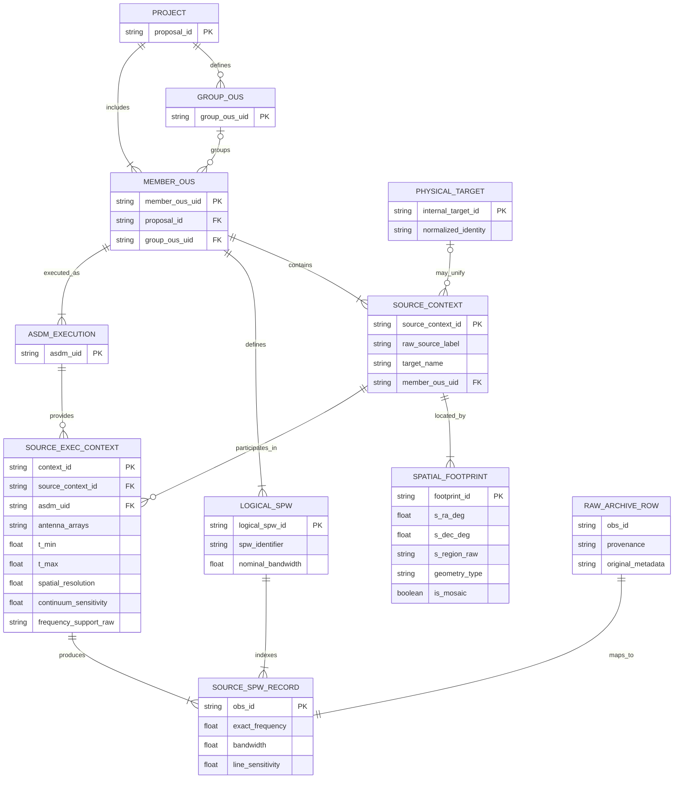

## Preliminary Internal Data Model v0.1

The following diagram summarizes the preliminary internal data model inferred
from the Archive experiments in Notebooks 1, 2, and 2b.

This is **not a reconstruction of ALMA's complete internal database schema**.
It is a proposed normalized representation for the duplication-checking tool,
derived from:

- official ALMA descriptions of the OUS hierarchy;
- IVOA ObsCore field definitions;
- observed identifier relationships;
- source-by-spectral-window row structures;
- multi-ASDM and mosaic counterexamples;
- field-stability analysis across representative Member OUS datasets.

### Interpretation

The model separates the flattened Archive response into several conceptual
levels:

1. **Project hierarchy** — Proposal, optional Group OUS, and Member OUS.
2. **Execution provenance** — one Member OUS may reference one or more ASDM
   executions.
3. **Source context** — preserves the raw source label and target metadata
   without assuming that identical or similar names represent the same physical
   target.
4. **Spatial footprint** — stores the reference coordinates and the complete
   `s_region` geometry separately from frequency-related records.
5. **Logical spectral window** — represents the SPW identifier and nominal
   bandwidth.
6. **Source–SPW record** — represents one cell of the observed source-by-SPW
   grid and preserves exact frequency and row-level sensitivity.
7. **Raw Archive row** — preserves the original TAP result for provenance and
   later validation.
8. **Physical target** — a future optional normalization layer that may unify
   multiple source labels without overwriting the original Archive metadata.

The intermediate `SOURCE_EXEC_CONTEXT` entity is included because field
stability alone cannot distinguish source-level properties from
execution-level properties. It allows the same source context to be associated
with multiple ASDM executions, antenna configurations, time ranges, or repeated
observing setups.

### Evidence status

- The OUS hierarchy and the interpretation of Member OUS as an independently
  processable dataset are supported by official ALMA documentation.
- The source-by-SPW grid structure, unique `obs_id` values, variable SPW counts,
  multi-source cases, and multi-ASDM cases are supported by the tested Archive
  samples.
- The placement of some fields, especially `frequency_support`, sensitivity,
  antenna information, and temporal coverage, remains preliminary.
- `PHYSICAL_TARGET` is a proposed application-level entity and is not directly
  supplied by the Archive.
- The model should be revised after frequency-support parsing and current-cycle
  CSV investigation.