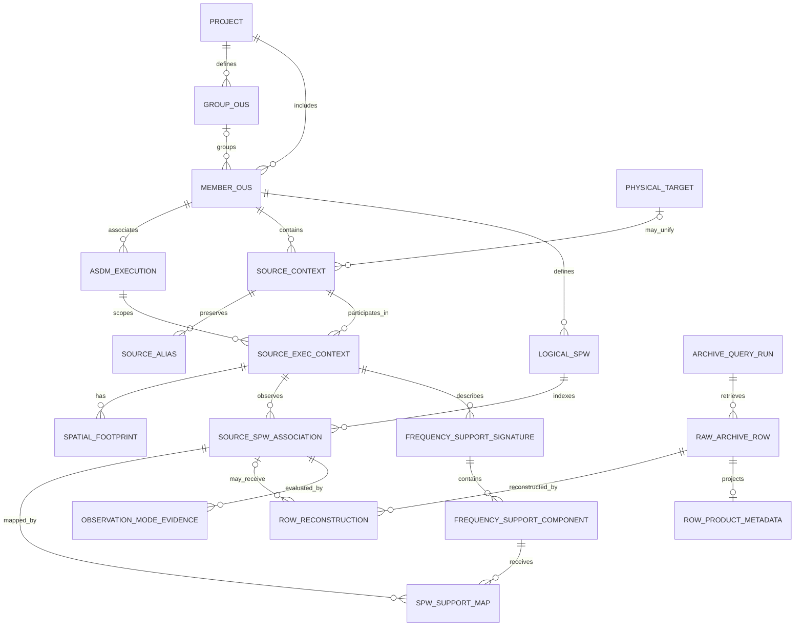
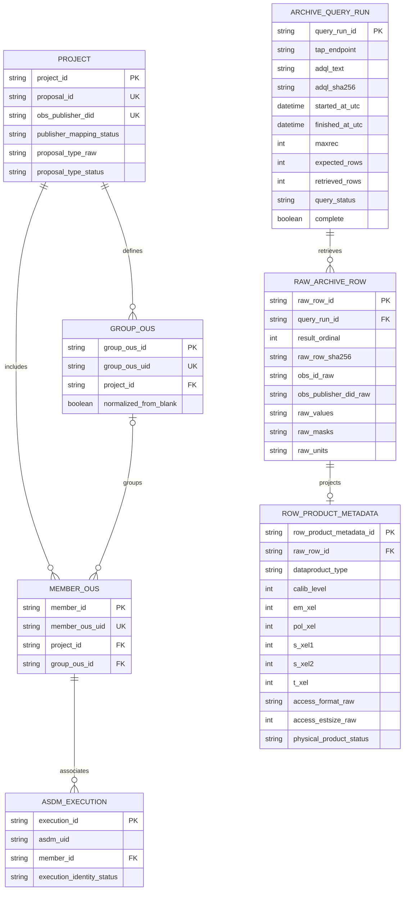
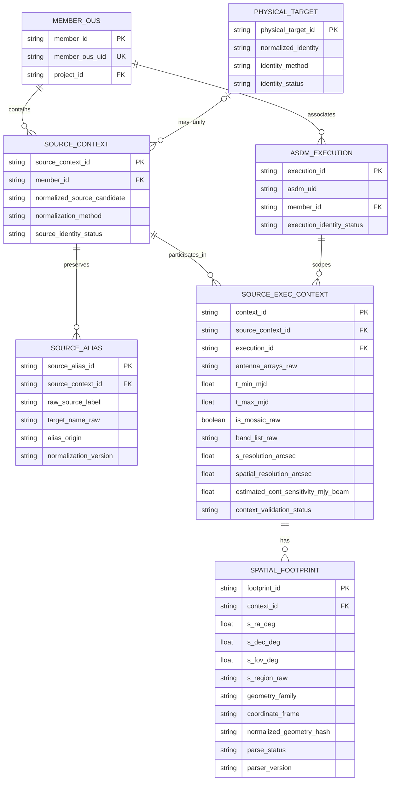
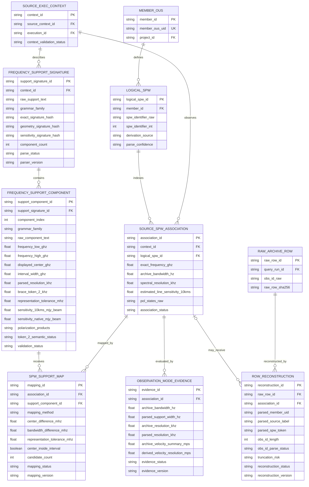
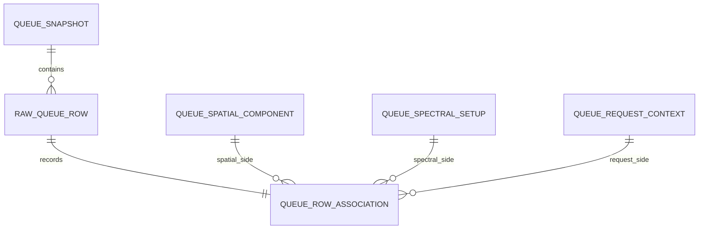

# Conceptual Archive data model

This is the conceptual design material moved from `docs/data_model.md` at
commit `76d50029a025d79c59b686b8a31c37bcf0f6227e` (document revision 0.6).
Its four Archive ERDs and entity descriptions preserve the original modeling
rationale. The original Queue association sketch is retained at the end.
No schema, table or Python class is created by this document. Attribute lists,
normalized hashes, aliases, durable histories and proposed confidence labels
must not be read as implemented APIs.

Use the [current data model](../data_model.md) for runtime objects and invariants,
the [Archive dictionary](../archive_data_dictionary.md) for selected fields and
status vocabularies, and [exploration snapshots](../evidence/exploration_snapshots.md)
for dated evidence. Implementation notes below describe the source revision;
current contracts own subsequent behavior. This design is not ALMA's internal
database schema and is not a second roadmap.

## Entity-relationship model

The diagrams below describe one conceptual model. The first diagram gives the
complete cardinality overview. The following diagrams repeat selected
relationships and add conceptual attributes so that the model remains
readable in Markdown. Attribute types are logical types, not final SQL DDL.

### Complete relationship overview



Cardinality notation:

| Marker | Meaning |
|---|---|
| `\|\|` | exactly one |
| `o\|` | zero or one |
| `\|{` | one or many |
| `o{` | zero or many |

The marker next to an entity states how many instances of that entity may be
related to one instance at the opposite end.

### Project, dataset, and raw-query provenance



`ROW_PRODUCT_METADATA` is a normalized projection of optional ObsCore fields,
not a claim that a physical product or downloadable file has been identified.
`PROJECT` uniqueness constraints apply to the current normalized snapshot;
the raw values still remain in `RAW_ARCHIVE_ROW` and are revalidated on ingest.

### Source, execution, alias, and footprint context



The repeated-source counterexample requires `SPATIAL_FOOTPRINT` and the other
varying fields to hang from `SOURCE_EXEC_CONTEXT`, not directly from
`SOURCE_CONTEXT`. `PHYSICAL_TARGET` remains optional and must not collapse raw
aliases or execution evidence.

### Spectral structure, support parsing, and row reconstruction



This is the central conceptual identity distinction:

- `SOURCE_SPW_ASSOCIATION` represents an observed logical association;
- `RAW_ARCHIVE_ROW` preserves one returned TAP row;
- `ROW_RECONSTRUCTION` records whether and how that row supports an
  association;
- `SPW_SUPPORT_MAP` maps the association to parsed support components; and
- `OBSERVATION_MODE_EVIDENCE` stores versioned spectral cross-checks without
  inferring correlator mode from channel count.

This separation permits parse failures, historical 64-character identifier
truncation, live response-schema drift, sparse Source-SPW associations,
multiple raw rows supporting one association, and multiple SPWs mapping to
one support component. It does not assert that multiple physical products or
files have been proven.

## Conceptual entity definitions and implementation notes

Uppercase entity names below are conceptual scopes, not a list of Python classes.
The [current object index](../data_model.md#current-object-index) identifies
implemented types. [Field projection](../archive_data_dictionary.md#production-projection-v1-schema-3-client-7)
is maintained separately.

### `PROJECT`

Represents the proposal/project scope exposed by the Archive.

Required attributes:

- internal `project_id`;
- raw `proposal_id`;
- raw `obs_publisher_did`;
- publisher/proposal mapping status.

In the closure snapshot, `proposal_id` and `obs_publisher_did` formed a
one-to-one mapping, and every publisher DID equalled
`ADS/JAO.ALMA#<proposal_id>`. The publisher DID is an alternate external
Project identifier, not a product or row identifier.

Top-level TAP `type` is optional Project-classification evidence. In the
2026-08-31 census, all 5,614 distinct proposal/type pairs matched the terminal
`proposal_id` suffix, with current values `S`, `L`, `T`, `V`, `SV`, `E`, `P`,
and `CAL`. The model treats this as an open value set and preserves unknown
future values. It is unrelated to `science_observation = 'T'` and must never
be used as an FDM/TDM label. The current production projection does not select this field; reconstruction
does not require it.

### `GROUP_OUS`

Optional grouping entity. Blank `group_ous_uid` values are normalized to
missing in the reconstructed model while the raw blank remains in
`RAW_ARCHIVE_ROW`.

### `MEMBER_OUS`

Outer independently processable dataset container identified by
`member_ous_uid`. A Member may contain multiple sources, SPWs, ASDM
associations, footprints, mosaic states, and support signatures. A Member is
not one observation, execution, product, or Archive row.

### `ASDM_EXECUTION`

Preserves `asdm_uid` and execution-related provenance. One Member may
associate with multiple ASDMs. The model does not claim that the public view
exposes the complete official execution schema.

### `SOURCE_CONTEXT` and `SOURCE_ALIAS`

`SOURCE_CONTEXT` is an internal source identity within a Member. It preserves
raw labels without claiming global physical-target identity. A provisional
reconstruction key is:

```text
(member_ous_uid, normalized source candidate)
```

`SOURCE_ALIAS` preserves every raw spelling and normalization method. Source
normalization alone is insufficient for physical identity; coordinates and
execution context must also be considered.

### `SOURCE_EXEC_CONTEXT`

Conservative context defined by:

```text
(member_ous_uid, asdm_uid, source_context_id)
```

It owns metadata demonstrated to vary for the same normalized source across
ASDMs, including:

- footprint and representative coordinates;
- time bounds;
- antenna configuration;
- raw frequency-support signature;
- mosaic state;
- separate `s_resolution` and `spatial_resolution` evidence; and
- estimated aggregate continuum-sensitivity evidence.

`spatial_resolution` is the primary Archive field for initial angular-
resolution candidate retrieval. `s_resolution` remains an independent
ObsCore cross-check. Neither value is modeled as a measured FITS restoring
beam.

### `SPATIAL_FOOTPRINT`

Execution-scoped spatial evidence containing:

- raw `s_region`;
- `s_ra`, `s_dec`, and `s_fov`;
- geometry family and coordinate frame;
- raw mosaic state;
- parser/validation status;
- footprint hash when derived.

Current top-level STC-S families are CIRCLE, POLYGON, and UNION, all observed
with ICRS in structural samples. ObsCore exposes aggregate footprints; it does
not demonstrate individual mosaic pointing identities.

### `LOGICAL_SPW`

Parsed SPW candidate scoped to a Member. SPW collections are variable length.
The raw token, parsing confidence, live-width status, and derivation method
are required. Historical evidence shows truncation at 64 characters, while
the current response VOTable independently reports the field datatype and
`arraysize`. These values must not be collapsed into one constant: a future
response may report `128*`, `*`, omit the descriptor, or provide invalid
metadata.

### `SOURCE_SPW_ASSOCIATION`

Explicit bridge between one Source-Execution context and one Logical SPW
candidate. It replaces the earlier assumption that Archive rows always form a
complete Source × SPW grid.

It may contain comparison-relevant row evidence such as:

- exact frequency;
- Archive bandwidth;
- spectral resolution;
- estimated nominal 10 km/s line sensitivity;
- polarization evidence;
- reconstruction confidence.

No missing association may be synthesized from Member-level SPW inventory.

### `FREQUENCY_SUPPORT_SIGNATURE`

Preserves one complete raw `frequency_support` string at Source-Execution
scope, with:

- top-level grammar family;
- exact raw-string hash;
- optional spectral-geometry and sensitivity hashes;
- component count;
- parse and validation status;
- parser version.

### `FREQUENCY_SUPPORT_COMPONENT`

Polymorphic parsed component. Common fields include raw component text,
component index, sensitivity values, polarization products, and validation
status.

Bracket-specific fields:

- lower and upper frequency;
- interval centre and width;
- parsed resolution.

Brace-specific fields:

- displayed centre frequency;
- representation tolerance derived from decimal precision;
- raw token 2 and normalized kHz value;
- token-2 semantic status.

For the complete current brace population, token 2 was numerically equal to
both spectral resolution and total bandwidth after unit conversion because
`em_xel=1`. Its semantic status therefore remains
`AMBIGUOUS_BANDWIDTH_VS_RESOLUTION_NUMERICAL_DEGENERACY`.

### `SPW_SUPPORT_MAP`

Versioned derived mapping between a Source-SPW association and a support
component. Attributes include:

- mapping method;
- centre and bandwidth differences;
- representation tolerance;
- containment candidates;
- ambiguity and validation status.

The relationship is not one-to-one. One support component may receive multiple
SPW mappings.

### `OBSERVATION_MODE_EVIDENCE`

Versioned comparison evidence attached to a Source-SPW association. It keeps
Archive values and parser-derived values side by side, including bandwidth,
spectral resolution, and velocity-resolution cross-checks. It is not an
identity entity and currently contains no formal correlator-mode evidence.

Public TAP `em_xel` remains on its raw row as an uninterpreted channel count.
Production does not convert that value into Archive UI `CONTINUUM`/`LINE` or
TDM/FDM. Formal mode remains unavailable until configuration-backed evidence
can be interpreted for the relevant processor and reliably associated with
the candidate SPW. No mode may be inferred solely from top-level `type`,
channel count, bandwidth, or resolution, and production does not depend on
the undocumented Archive Elasticsearch endpoint.

### `ARCHIVE_QUERY_RUN`

Records endpoint, ADQL, normalized parameters, start/end time, MAXREC,
expected count, retrieved count, `QUERY_STATUS`, warnings, completeness, and
query hash. A response with `OVERFLOW`, a count mismatch, or an execution error
must never support a negative duplication conclusion.

The current Archive client preserves the selected column-name schema and an ordered
retrieval field-metadata snapshot containing name, datatype, arraysize, unit,
UCD, utype, xtype, and description. It retains descriptors even when the
retrieval contains zero rows and links them to the same query result and
capture provenance. Descriptor names must match declared columns in order.

### `RAW_ARCHIVE_ROW`

Immutable evidence record with an internal surrogate `raw_row_id`. It
preserves all original TAP values, masks, units, identifiers, result order,
and a content hash. It is linked to the exact `ARCHIVE_QUERY_RUN` that
retrieved it. Parsing never overwrites this entity.

Service-unit and field-description evidence remains available through the
current `ArchiveQueryResult` and therefore through `ArchivePipelineBatch.query_result`.
Normalization and parsing do not overwrite descriptor text. Durable storage
must later serialize the tuple without changing its order or optional `None`
values. The Archive ingestion adapter validates the six comparison-facing units,
converts compatible source units into canonical values, and preserves
missing/incompatible states. The implemented [comparison-context builders](../comparison_contexts.md) retain
this typed evidence rather than recasting raw row values. Formal cross-source
comparison remains unimplemented. Archive
reconstruction already consumes the canonical typed `frequency` value, so a
compatible TAP unit change cannot split comparison evidence from
frequency-support mapping. Comparison quantities must be finite and strictly
positive, and frequency coverage is unavailable unless its canonical bounds
satisfy `0 < lower < upper`.

### `ROW_PRODUCT_METADATA`

Optional normalized projection of row-level ObsCore product metadata such as
`dataproduct_type`, `calib_level`, axis sizes, access format, and estimated
size. It exists to make optional fields queryable without naming the row a
physical product. The current public view does not expose a reliable file or
product identifier, and entirely NULL fields remain valid values in the raw
row.

Recommended `obs_id` confidence states:

```text
PARSED_COMPLETE
PARSED_AT_HISTORICAL_TRUNCATION_BOUNDARY
FAILED_AT_HISTORICAL_TRUNCATION_BOUNDARY
FAILED_OTHER
```

The response FIELD descriptor is interpreted independently as
`BOUNDED_VARIABLE`, `FIXED`, `UNBOUNDED`, `MISSING`, `INVALID`, or
`INCOMPATIBLE_DATATYPE`. Width conformance is then stored as
`NOT_EVALUABLE`, `WITHIN_UNBOUNDED`, `BELOW_REPORTED_MAXIMUM`,
`AT_REPORTED_MAXIMUM`, or `ABOVE_REPORTED_MAXIMUM_SCHEMA_DRIFT`.

For VOTable character fields, `N*` is treated as variable length with a
reported maximum of `N`, while `*` is unbounded. Missing or unusable live
metadata is never replaced with 64. The historical 64-character boundary is
retained separately and remains unsafe even if a later response reports a
larger maximum. Conversely, complete grammar above a reported maximum may
proceed to cross-field reconstruction while retaining schema-drift evidence.
Malformed values remain parse failures regardless of their length.

### `ROW_RECONSTRUCTION`

Reconstruction v3 additionally returns `frequency_support_evidence`, a
canonical tuple keyed by raw row ID. Each entry stores the complete spectral
parser result independently of whether the row can be linked. Mapping reuses
that object; it never triggers a second parse. Component references carry raw
row ID, parser version and component index. All ambiguous candidates remain
available, while only assigned mappings expose a selected component. The
existing parser v2 grammar and scientific semantics are unchanged.

Versioned reconstruction attempt for a raw row. An attempt may remain
unlinked from any Source-SPW association when parsing is unsafe; later parser
versions can create additional attempts without mutating earlier evidence.
Multiple raw rows may link to one association without claiming that physical
product multiplicity has been resolved. Reconstruction diagnostics include:

- raw `obs_id` length;
- parsed Member, source, and SPW candidates;
- parse status and issue codes;
- raw VOTable datatype/`arraysize`, their interpretation and source;
- live reported-maximum relation, historical truncation risk, and
  schema-drift status;
- reconstruction algorithm version and confidence.

### `PHYSICAL_TARGET`

Optional future application entity for alias resolution. It must never replace
raw source labels, coordinates, footprints, or execution provenance. Moving
and Solar-system targets require dedicated logic.

## Queue association sketch

Moved from the former Queue contract's reconstruction section. This sketch
applies to accepted rows after the complete-ingestion gate; failed raw rows
remain diagnostic evidence and do not each acquire an association. The current
[Queue object contract](../data_model.md#queue-row-associations) owns implemented
membership and cardinalities. Uppercase labels summarize the relationship;
they are not additional Python classes or database tables.


