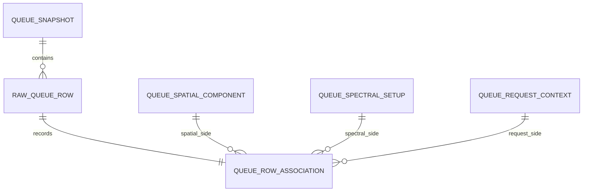

# Current-Cycle Queue CSV Ingestion Contract v1

## Purpose

This document defines the production-ingestion boundary for the public ALMA
current-cycle duplication-check CSV. It translates the evidence established in
`notebooks/05_queue_csv_exploration.ipynb` into a versioned contract for the
Queue CSV client, parser, adapter, and reconstruction pipeline.

The Queue CSV is proposal-side evidence for observations that are still in the
observing queue. It is not an Archive table, a normalized relational export, or
an authoritative representation of every internal Science Goal or Scheduling
Block relationship.

The ingestion layer must preserve the file as delivered, validate its physical
and logical structure, normalize only documented quantities, and reconstruct
only relationships that are explicitly represented by source rows.

A malformed, partially adapted, or structurally incompatible Queue snapshot
must never support a negative duplication conclusion.

## Scope

The v1 ingestion contract is responsible for:

- recording source and snapshot provenance before parsing;
- preserving the source description, embedded dictionary, secondary header,
  operational header, raw values, and raw unit declarations;
- validating the versioned 79-column operational schema;
- assigning a stable internal identity to every physical source row;
- interpreting the 16 numbered SPW slots as aligned triples;
- distinguishing regular-SPW rows from spectral-scan rows;
- preserving spatial, spectral, sensitivity, array, and polarization evidence;
- normalizing documented units without overwriting their raw representation;
- deriving Queue-side sky-frequency intervals with explicit provenance;
- reconstructing spatial, spectral, and request components from observed rows;
- preserving exact export multiplicity; and
- reporting schema drift, unit conflicts, unsupported values, and failed
  consistency checks through structured issues.

The v1 ingestion contract does not:

- query the ALMA Science Archive;
- compare Queue rows with Archive candidates;
- apply Appendix A duplication thresholds;
- infer an official Science Goal, Scheduling Block, or execution identifier;
- infer authoritative TDM/FDM mode from bandwidth or resolution;
- reconstruct individual windows inside a spectral scan;
- align Queue velocity frames with Archive frequency frames;
- calculate HPBW mosaic overlap;
- convert requested `mJy` sensitivity into achieved `mJy/beam`; or
- classify moving or Solar System targets from names or zero coordinates.

Those operations belong to later shared-comparison and policy layers.

## Evidence snapshot

The v1 contract is based on the public file inspected in Notebook 05.

| Property | Observed value |
|---|---:|
| Source page | `https://almascience.eso.org/proposing/duplications` |
| Retrieval date used by the exploration | 2026-09-01 |
| Source-provided queue date in the description | 2026-03-03 |
| SHA-256 | `8657108b59295c62d3f1f6635bf3571404f5d43bc5800c4a2e7ea3ba51a111b5` |
| Physical CSV records | 3,241 |
| Embedded dictionary entries | 35 |
| Operational columns | 79 |
| Data rows | 3,200 |
| Unique exact row-content fingerprints | 3,135 |
| Rows participating in exact-content duplicates | 75 |
| Excess duplicate copies | 65 |

The retrieval date, source-provided queue date, and checksum describe different
facts and must not be substituted for one another. Counts in this section are
regression evidence for the pinned snapshot, not permanent ALMA-wide
cardinality constraints.

A compatible future snapshot may contain different projects, row counts, SPW
occupancy, and category values. It must receive a new checksum and capture
provenance and must pass the same schema and consistency gates before entering
reconstruction.

## Physical file layout

The pinned snapshot has the following physical layout:

| Physical line | Meaning |
|---:|---|
| 1 | Source description |
| 2 | Blank separator |
| 3 | Embedded-dictionary header: `Column Heading,Units,Description` |
| 4–38 | 35 embedded-dictionary entries |
| 39 | Blank separator |
| 40 | 79-column operational header |
| 41 | Mixed secondary header/unit row |
| 42–3241 | 3,200 operational data rows |

The parser must identify sections by structural anchors and then validate their
positions. It must not assume that an arbitrary future file always begins its
operational table on line 40.

Required anchors include:

```text
Column Heading,Units,Description
```

and an operational header containing the complete versioned column set,
including:

```text
Project Code
Target Name
RA
Dec
Ref.Frequency
SPS Start Freq.
Freq SPW 1
Bandwidth SPW 1
Spec.Res. SPW 1
```

CSV parsing must use standard CSV quoting rules. The checksum is calculated
from the original bytes before decoding. UTF-8 with an optional byte-order mark
is accepted. Pandas must not be the source-of-truth ingestion boundary because
implicit NA, boolean, and numeric coercion can alter raw evidence.

## Operational schema

### Scalar columns

The operational table begins with 31 scalar or conditionally populated
columns:

```text
Project Code
Target Name
RA
Dec
RA_HMS
Dec_DMS
Long Offset
Lat Offset
Velocity
Vel. Frame
Vel. Convention
Mosaic
Mos. Length
Mos. Width
Mos. PA
Mos. Spacing
Mos. Coord.
Band
Req. Ang. Res.
Req. LAS
Use 7-m?
Use TP?
Polarization
Ref.Frequency
Ref.Freq.Width
Req.Sensitivity
Is Sky Freq?
SPS Start Freq.
SPS End Freq.
SPS Bandwidth
SPS Spec. Res.
```

### Numbered SPW columns

The remaining 48 columns reserve 16 numbered SPW slots for three aligned
properties:

```text
Freq SPW 1 ... Freq SPW 16
Bandwidth SPW 1 ... Bandwidth SPW 16
Spec.Res. SPW 1 ... Spec.Res. SPW 16
```

The physical column order groups values by property. The logical structure
groups them by slot number:

```text
SPW N = Freq SPW N
      + Bandwidth SPW N
      + Spec.Res. SPW N
```

The 48 columns therefore represent 16 aligned triples, not 16 frequencies ×
16 bandwidths × 16 resolutions and not an observed relationship between every
spatial and spectral component.

All 79 operational columns are required schema columns. Individual values may
be blank only where the field's row-level semantics permit it.

## Embedded dictionary and secondary header

The source exposes field documentation in two representations:

1. the embedded three-column dictionary; and
2. the row immediately below the operational header.

The second representation is not a pure unit row. For `Mos. Coord.`, its token
is `Ref. Sys.`, which continues the field name `Mos. Coord. Ref. Sys.` rather
than declaring a unit. The production model must therefore call this the
`secondary_header_row` and classify each nonblank token as one of:

```text
UNIT
HEADER_CONTINUATION
UNEXPECTED
```

Blank tokens remain blank evidence and are not rewritten as a unit category.

The parser must preserve both source representations even after resolving them
to a canonical field name or unit.

## Known schema and unit discrepancies

Notebook 05 established seven explicit differences between the embedded
dictionary and operational table:

| Topic | Embedded dictionary | Operational representation | v1 handling |
|---|---|---|---|
| SPS bandwidth unit | `[MHz]` | `[GHz]` | Preserve both; normalize the pinned schema as MHz with a structured warning |
| Velocity unit spelling | `[km/s]` | `[kms/s]` | Normalize to `km/s`; preserve both raw strings |
| Mosaic datatype | `[boolean]` | `Custom`, `Rectangle`, or blank | Treat as a categorical value, never a boolean |
| `standAlone_ACA` | Present | No operational column | Preserve the dictionary entry; do not require or synthesize a data value |
| SPW resolution template | `Spec.Res SPW [N]` | `Spec.Res. SPW N` | Use an explicit template alias |
| Mosaic reference-system field | `Mos. Coord. Ref. Sys` | `Mos. Coord.` plus `Ref. Sys.` | Join only at the metadata layer; preserve both source tokens |
| Requested LAS spelling | `Req.LAS` | `Req. LAS` | Use an explicit alias |

These mappings are versioned contract decisions, not general fuzzy matching.
Unknown near-matches must produce schema drift rather than being guessed from
string similarity.

### SPS bandwidth decision

The pinned snapshot contains one spectral-scan row:

| Field | Value |
|---|---:|
| Project | `2025.1.00299.S` |
| Target | `HBC_687` |
| Band | `ALMA_RB_06` |
| Start frequency | 261.5 GHz |
| End frequency | 268.7 GHz |
| Raw SPS bandwidth | 1000.0 |
| SPS spectral resolution | 0.000564453125 MHz |
| Sensitivity reference frequency | 265.141 GHz |
| Sensitivity reference width | 0.565 MHz |

Interpreting the raw bandwidth as 1,000 GHz is inconsistent with the 7.2-GHz
scan range and Band 6 context. Interpreting it as 1,000 MHz is numerically and
scientifically plausible and agrees with the embedded dictionary description,
which defines it as the bandwidth of each scan window.

For the pinned schema, the parser therefore uses MHz as the normalized unit
while retaining:

- the dictionary declaration;
- the secondary-header declaration;
- the raw numeric value;
- the chosen normalized unit;
- the resolution method; and
- a `CONFLICTING_UNIT_DECLARATION` warning.

A future change in either declaration must be revalidated. It must not silently
inherit this evidence-based resolution.

## Field semantics and canonical units

### Identity, coordinate, and spatial fields

| Operational field | Canonical type | Canonical unit | Row-level interpretation |
|---|---|---|---|
| `Project Code` | text | — | Proposal/project label; required, but not a raw-row key |
| `Target Name` | text | — | Raw target label; not a physical-target identifier |
| `RA`, `Dec` | float | deg | Decimal coordinates; zero is a valid source value and is not missing |
| `RA_HMS`, `Dec_DMS` | text | — | Source-formatted coordinate evidence |
| `Long Offset`, `Lat Offset` | float | arcsec | RA/Dec or galactic offsets according to mosaic reference system |
| `Mosaic` | category | — | `Custom`, `Rectangle`, or blank in the pinned snapshot |
| `Mos. Length`, `Mos. Width` | float | arcsec | Rectangle geometry when applicable |
| `Mos. PA` | float | deg | Rectangle position angle |
| `Mos. Spacing` | float | arcsec | Requested mosaic spacing |
| `Mos. Coord.` | text | — | Mosaic coordinate reference system; blank, `ICRS`, or `galactic` observed |
| `Band` | text | — | Raw ALMA band label, such as `ALMA_RB_06` |

The embedded dictionary uses the quote-symbol notation `["]` for angular
offset and mosaic-size fields. The operational secondary header makes the
intended unit explicit as arcseconds. Both source forms remain available.

### Velocity, request, and sensitivity fields

| Operational field | Canonical type | Canonical unit | Row-level interpretation |
|---|---|---|---|
| `Velocity` | float | km/s | Coordinate defined by the declared convention; not one generic physical-speed field |
| `Vel. Frame` | category | — | `lsrk`, `hel`, and `topo` observed |
| `Vel. Convention` | category | — | `RADIO`, `OPTICAL`, and `RELATIVISTIC` observed |
| `Req. Ang. Res.` | float | arcsec | Requested angular resolution |
| `Req. LAS` | float | arcsec | Requested largest angular scale; non-negative, with source `0.0` preserved without assigning policy semantics |
| `Use 7-m?` | boolean | — | Proposal requests the ACA 7-m array |
| `Use TP?` | boolean | — | Proposal requests Total Power |
| `Polarization` | category | — | Raw proposal-side polarization request |
| `Ref.Frequency` | float | GHz | Reference frequency for requested sensitivity |
| `Ref.Freq.Width` | float | MHz | Independent bandwidth/smoothing width for requested sensitivity |
| `Req.Sensitivity` | float | mJy | User-requested RMS evidence; not achieved Archive sensitivity |
| `Is Sky Freq?` | boolean | — | Whether SPW/SPS source frequencies are already sky frequencies |

`Req.Sensitivity` must remain `mJy`. The ingestion layer must not append
`/beam`, convert it to an Archive sensitivity field, or label it achieved RMS.

### Spectral fields

| Operational field | Canonical type | Canonical unit | Population rule |
|---|---|---|---|
| `SPS Start Freq.` | float | GHz | Required only for a spectral-scan row |
| `SPS End Freq.` | float | GHz | Required only for a spectral-scan row |
| `SPS Bandwidth` | float | MHz | Per-window scan bandwidth under the v1 evidence resolution |
| `SPS Spec. Res.` | float | MHz | Scan spectral resolution |
| `Freq SPW N` | float | GHz | Central frequency for regular SPW N |
| `Bandwidth SPW N` | float | MHz | Full bandwidth for regular SPW N |
| `Spec.Res. SPW N` | float | MHz | Spectral resolution for regular SPW N |

Raw and canonical units are both part of the ingested evidence. A production
quantity retains the raw token, parsed raw numeric value, embedded-dictionary
unit, physical secondary-header token, canonical value and unit, and a
unit-interpretation status. For the known SPS conflict this makes the
dictionary-based MHz decision explicit instead of making `1000.0 [GHz]`
appear to have been silently converted. Conversion must never overwrite source
strings.

## Raw-row identity and preservation

One operational data record becomes one `RawQueueRow`. Its internal identity
is scoped to the exact snapshot:

```text
(snapshot_sha256, physical_start_line)
```

If a valid quoted CSV record spans multiple physical lines, the parser also
records the ending line, but the starting physical line remains part of the
identity.

Every raw row preserves:

- all 79 source values as strings;
- source column order;
- physical line provenance;
- snapshot checksum;
- a deterministic content fingerprint;
- parser and schema versions; and
- any row-scoped issues.

The content fingerprint is diagnostic evidence, not identity. Exact duplicate
exports retain distinct raw-row IDs and distinct observed associations. A
summary may group identical fingerprints and report their multiplicity, but it
must retain all contributing source lines.

## Regular SPW representation

For each slot `N` from 1 through 16, the three aligned fields must be either:

```text
all blank
```

or:

```text
all populated and numerically valid
```

A partially populated triple is `PARTIAL_SPW_TRIPLE` and prevents the file
from being treated as a complete policy input.

Populated slots are retained with their source numbers. If a future row
contains slots 1, 2, and 4 while slot 3 is blank, the parser must preserve
1, 2, and 4 and report `NONCONTIGUOUS_SPW_SLOTS`; it must not renumber slot 4.

The pinned snapshot provides the following evidence:

| Property | Observed value |
|---|---:|
| Reserved slots | 16 |
| Highest populated slot | 7 |
| Rows with partial triples | 0 |
| Rows with non-contiguous populated slots | 0 |
| Long-form regular-SPW records | 16,216 |

Slots 8–16 are valid reserved schema fields even though they are empty in the
pinned snapshot.

## Spectral-scan representation

The four SPS fields form one separate spectral representation. They must be
either all blank or all populated.

Each row must satisfy exactly one of:

```text
regular SPW fields populated and SPS fields blank
```

or:

```text
SPS fields populated and all regular SPW fields blank
```

The pinned snapshot contains 3,199 regular rows and one complete SPS row. No
row contains both representations, neither representation, or a partial SPS
record.

The SPS range is not expanded into synthetic ordinary SPWs. The CSV does not
provide the individual scan-window centres, number, spacing, or overlap
required to reconstruct those windows authoritatively. The normalized model
therefore uses a tagged union such as:

```text
QueueSpectralSetup = RegularSpwSetup | SpectralScanSetup
```

and records spectral-scan window expansion as unavailable.

## Spatial interpretation

The spatial signature is scoped to the raw project, target, and band context
and preserves at least:

```text
RA
Dec
Long Offset
Lat Offset
Mosaic
Mos. Length
Mos. Width
Mos. PA
Mos. Spacing
Mos. Coord.
```

Notebook 05 selected `1e-6 arcsec` as the zero-classification tolerance for
offsets and mosaic geometry. This tolerance determines whether a value is
effectively zero for classification; it does not round, replace, or hash the
raw value.

Pinned-snapshot evidence at this tolerance includes:

- 2,940 rows labelled `Custom`;
- 140 rows labelled `Rectangle`;
- 120 rows with a blank mosaic label;
- 420 repeated custom-mosaic centre rows;
- 2,520 repeated custom-mosaic offset rows;
- 231 custom-mosaic project–target–band groups;
- exactly one centre and six offset spatial components in every custom group;
- rectangle extents on all 140 rectangle rows; and
- nine blank-labelled rows with meaningful nonzero offsets.

Consequently:

- `Mosaic` is categorical, not boolean;
- blank `Mosaic` does not prove that all offsets or geometry are zero;
- repeated rows do not create new spatial components; and
- aggregate rectangle geometry is not silently expanded into pointings.

Unknown future mosaic categories must be preserved and reported rather than
coerced into one of the current categories.

## Frequency and velocity normalization

`Is Sky Freq?` determines how SPW and SPS source frequencies are interpreted.
If it is true, the source frequency is already a sky frequency in the row's
declared context. If it is false, the source frequency is a rest frequency and
the Queue-side observed frequency is derived from `Velocity`, `Vel. Frame`, and
`Vel. Convention`.

With `c = 299792.458 km/s` and `beta = v/c`, the v1 Queue-side conversions are:

```text
RADIO:
    observed = rest * (1 - beta)

OPTICAL:
    observed = rest / (1 + beta)

RELATIVISTIC:
    observed = rest * sqrt((1 - beta) / (1 + beta))
```

The mathematical domains are validated per convention:

```text
RADIO:        beta < 1
OPTICAL:      1 + beta > 0
RELATIVISTIC: abs(beta) < 1
```

An optical convention value may numerically exceed `c` because it commonly
represents the coordinate `cz`; it must not be rejected by a generic physical
speed check.

Every derivation preserves:

- raw frequency and unit;
- raw velocity and unit;
- velocity frame;
- velocity convention;
- declared sky/rest status;
- derived sky frequency;
- Doppler factor;
- formula/convention;
- derivation version; and
- validation status.

For a rest-frequency row, the SPW bandwidth is multiplied by the same frequency
ratio used for its centre before the sky-frequency interval is formed:

```text
doppler_factor = derived_sky_frequency / source_frequency
derived_sky_bandwidth_ghz = bandwidth_mhz / 1000 * doppler_factor
lower = derived_sky_frequency - derived_sky_bandwidth_ghz / 2
upper = derived_sky_frequency + derived_sky_bandwidth_ghz / 2
```

The reference-frequency consistency gate permits a numerical boundary
tolerance of `1e-12 GHz` and requires `Ref.Frequency` to lie inside at least one
derived interval for a regular row. The pinned snapshot passed for all 3,199
regular rows. The SPS row's reference frequency also lies inside its declared
scan range.

This is an internal Queue consistency check. It does not prove that the derived
frequency is already in the same reference frame as an Archive candidate.
Archive/Queue frame alignment remains a comparison-layer requirement.

## Requested-sensitivity semantics

The three proposal-side fields form one inseparable requested-sensitivity
record:

```text
Ref.Frequency [GHz]
Ref.Freq.Width [MHz]
Req.Sensitivity [mJy]
```

All 3,200 pinned-snapshot rows contain positive values for all three fields.
The values vary within some project–target–band groups and therefore belong to
the spectral/setup side of reconstruction rather than to target identity.

`Ref.Freq.Width` is an independent request value. In the 3,199 regular rows:

- 29 match the derived aggregate non-overlapping bandwidth;
- three match a source SPW spectral resolution; and
- 3,167 are other or user-defined reference widths.

The parser must not recompute this field from SPW bandwidth or resolution.

For the SPS row, the 0.565-MHz reference width is approximately 1,001 times the
native scan resolution and 0.000565 of the 1,000-MHz per-window bandwidth. Its
requested 2.5-mJy sensitivity is therefore tied to the separate reference
width, not to a native spectral element or a complete scan window.

Requested Queue sensitivity and estimated Archive sensitivity must remain
separate evidence types until the rule layer defines an approved smoothing and
unit-comparison method.

## Reconstruction and observed associations

The Queue CSV is a flattened export. Repeated spatial and spectral signatures
are factored into reusable components, but source-row associations remain the
only authoritative links between them.



One accepted raw row produces exactly one `QueueRowAssociation` linking:

```text
one RawQueueRow
one QueueSpatialComponent
one QueueSpectralSetup
one QueueRequestContext
```

The analytical group key used in Notebook 05 is:

```text
(Project Code, Target Name, Band)
```

It is a reconstruction scope, not an official ALMA Science Goal or Scheduling
Block identifier.

Within 419 pinned-snapshot groups:

- 417 groups' observed spatial–spectral pairs happen to fill the local
  Cartesian product;
- `2025.1.00539.S / M33 / ALMA_RB_06` has five spatial and five spectral
  signatures but only five observed pairs rather than 25; and
- `2025.1.00576.L / NGC_0253 / ALMA_RB_06` has two spatial and two spectral
  signatures but only two observed pairs rather than four.

The production reconstruction must therefore never generate:

```text
all spatial components × all spectral setups
```

even when that shortcut reproduces most current groups. It stores only pairs
observed on raw source rows.

Five pinned-snapshot groups also contain repeated identical exports. Their
raw-row multiplicity and source-line provenance remain evidence and are not
discarded during component deduplication.

## Component signatures

Component signatures are internal, deterministic, versioned identifiers. They
are not ALMA identifiers.

A spatial signature includes its group scope and exact raw spatial values. A
spectral signature includes its group scope, velocity context, sky/rest flag,
the complete regular-SPW collection or SPS record, and the requested
sensitivity triple. A request-context signature includes requested angular
resolution, requested LAS, array flags, and polarization.

Raw strings are used for identity signatures. Normalized floating-point values
are used for scientific calculations but must not become identity merely after
rounding. Each signature records its algorithm version.

Input row order may not change the set of reconstructed component signatures
or the multiset of logical associations. Raw-row IDs still reflect physical
line provenance and therefore remain row-specific.

## Missing and categorical values

Empty source strings are preserved before interpretation. Their meaning is
field-specific:

- blank SPS fields are expected on a regular-SPW row;
- blank regular-SPW fields are expected after the last populated slot and on
  an SPS row;
- blank mosaic label is a current category, not automatically missing spatial
  evidence;
- blank mosaic reference system is permitted where no source value is given;
- zero coordinates, offsets, or geometry values are numeric values, not
  missing values;
- `Req. LAS = 0.0` is valid source evidence in the pinned snapshot; ingestion
  preserves it and leaves any sentinel or policy meaning to a later contract;
  and
- absent operational `standAlone_ACA` cannot be reconstructed from its
  dictionary description.

Boolean parsing accepts only the versioned source literals `True` and `False`
after surrounding whitespace handling. Unknown literals are preserved and
reported. Category parsing preserves unknown future values and never silently
maps them by substring or capitalization heuristics.

## Result and issue contract

The Queue client exposes immutable status and issue objects. The
minimum ingestion statuses are:

| Status | Meaning | May enter reconstruction? |
|---|---|---:|
| `COMPLETE` | Compatible schema and all required consistency gates passed without warnings | Yes |
| `COMPLETE_WITH_WARNINGS` | Compatible and complete; known non-destructive discrepancies are preserved | Yes |
| `ERROR` | Layout, schema, required value, or scientific consistency validation failed | No |

The pinned snapshot is expected to be `COMPLETE_WITH_WARNINGS` because the SPS
bandwidth source declarations conflict even though the v1 evidence resolution
permits normalization.

At minimum, structured issues distinguish:

```text
LAYOUT_NOT_FOUND
DUPLICATE_COLUMN
MISSING_REQUIRED_COLUMN
UNEXPECTED_COLUMN
ROW_WIDTH_MISMATCH
INVALID_NUMERIC_VALUE
INVALID_BOOLEAN_VALUE
UNSUPPORTED_CATEGORY
PARTIAL_SPW_TRIPLE
NONCONTIGUOUS_SPW_SLOTS
PARTIAL_SPS_RECORD
MIXED_REGULAR_AND_SPS
MISSING_SPECTRAL_REPRESENTATION
CONFLICTING_UNIT_DECLARATION
REFERENCE_FREQUENCY_OUTSIDE_COVERAGE
SCHEMA_DRIFT
```

Each issue preserves severity, message, snapshot identity, optional raw-row
identity, column or slot, raw value, and contract/parser version.

Raw rows and available diagnostics may be retained for an `ERROR` result, but
the result is not complete and cannot support candidate absence or enter the
policy pipeline.

## Schema-drift policy

Schema validation uses the declared operational header, not keys inferred from
the first data row. This allows the client to validate even a syntactically
valid zero-data snapshot.

The v1 policy is:

| Change | Handling |
|---|---|
| Missing required operational column | `ERROR` |
| Duplicate operational column | `ERROR` |
| Row width differs from declared header | `ERROR` |
| New unrecognized column | Preserve the header and return `ERROR / SCHEMA_DRIFT` pending review; do not guess semantics |
| Reordered known columns | Read by declared name, preserve source order, and return `COMPLETE_WITH_WARNINGS` if no semantic information is lost |
| Changed source unit | Preserve both metadata sources and return `ERROR / SCHEMA_DRIFT` unless the exact conflict has a versioned resolution |
| New category value | Preserve the raw value; return `ERROR` when required normalization is impossible, otherwise retain an explicit `UNKNOWN` value with a warning |
| Changed SPW numbering/template | Return `ERROR / SCHEMA_DRIFT`; do not renumber or fuzzy-match |

An unknown field or changed unit is never silently ignored merely because the
current parser does not yet use it for policy decisions.

## Capability boundary

A complete Queue parse does not imply that every future duplication rule is
decidable. The parsed batch must expose unavailable capabilities separately
from ingestion completeness.

The pinned schema does not provide:

- authoritative per-SPW TDM/FDM mode;
- a stable Science Goal, Scheduling Block, or spectral-setup identifier;
- an explicit moving-object or Solar-observation flag;
- an ephemeris identity;
- individual spectral-scan window centres or spacing; or
- a completed Archive/Queue reference-frame mapping.

Missing capabilities must not be filled by target-name heuristics, bandwidth
thresholds presented as correlator mode, or undocumented Web endpoints.

Bandwidth-based continuum criteria may later be computed as policy evidence,
but such a result is not an authoritative TDM label. Final rule behavior for
unavailable correlator mode must be agreed with the supervisor and represented
explicitly in the rule contract.

## Production pipeline boundary

The intended v1 flow is:

```text
source bytes
    -> QueueSnapshot
    -> RawQueueRow collection
    -> typed Queue row projection
    -> QueueSpatialComponent
    -> QueueSpectralSetup
    -> QueueRequestContext
    -> observed QueueRowAssociation
    -> QueuePipelineBatch
```

Normalization and reconstruction may run only when the full ingestion result
is complete. The raw snapshot, raw rows, unit evidence, issues, and derivation
provenance remain reachable from the final batch.

Queue reconstruction remains separate from Archive reconstruction. A shared
comparison model may consume both completed batches later; neither source is
forced into the other's raw schema during ingestion.

The v1 implementation is split across these source-independent boundaries:

| Responsibility | Module |
|---|---|
| Versioned columns, aliases, units, and tolerances | `alma_duplicate.queue_csv_contract` |
| Raw-byte parsing and typed row projection | `alma_duplicate.parsers.queue_csv` |
| Queue-side Doppler and interval derivation | `alma_duplicate.queue_normalization` |
| Observed-association reconstruction | `alma_duplicate.queue_reconstruction` |
| Local snapshot read boundary | `alma_duplicate.clients.queue_csv_client` |
| Completeness gate and pipeline batch | `alma_duplicate.clients.queue_csv_adapter` |

## Offline test boundary

Ordinary unit and integration tests must be deterministic and network-free.
They require:

- a small local CSV fixture preserving the full physical layout;
- all 79 operational columns;
- the mixed secondary header/unit row;
- regular rows with multiple numbered SPWs;
- one complete SPS row;
- an exact-content duplicate with distinct source lines;
- a sparse spatial–spectral pairing example;
- custom centre and offset examples;
- a rectangle example; and
- explicit malformed cases for partial SPWs, partial SPS, mixed spectral
  representations, row-width errors, and schema drift.

The central sparse-association test must demonstrate that two spatial and two
spectral components represented by two source rows produce two associations,
not four.

The full pinned snapshot remains a local acceptance test. Its expected
regression checks include:

```text
raw_rows = 3200
operational_columns = 79
regular_rows = 3199
sps_rows = 1
long_spw_records = 16216
row_associations = 3200
partial_spw_triples = 0
noncontiguous_spw_rows = 0
reference_frequency_failures = 0
project_target_band_groups = 419
sparse_or_paired_groups = 2
groups_with_exact_export_multiplicity = 5
```

The complete public snapshot does not need to become the only CI fixture. Its
checksum and counts are snapshot-specific and will change when ALMA publishes
a new queue export.

The optional full-snapshot acceptance test is run with:

```bash
ALMA_QUEUE_CSV_SNAPSHOT=/absolute/path/to/duplication-check.csv \
python -m pytest -q tests/acceptance/test_queue_csv_snapshot.py
```

## Versioning

The following versions are independent:

- Queue schema-contract version;
- parser version;
- unit-normalization version;
- frequency-derivation version;
- spatial-signature version;
- spectral-signature version; and
- reconstruction version.

The schema-contract version changes when required columns, aliases, source
unit interpretation, or population rules change. Algorithm versions change
when the implementation changes without redefining the source schema.

Every newly downloaded cycle or replacement snapshot must record a checksum,
capture time, source description, field dictionary, operational header,
secondary header, and validation result. New evidence may extend this
contract, but it must not retroactively change the preserved interpretation of
an earlier snapshot without an explicit migration.

## Closure decision

Notebook 05 provides sufficient evidence for Queue CSV ingestion and
reconstruction v1. The production implementation now enforces this contract
with offline unit/integration fixtures and an optional pinned-snapshot
acceptance test.

Remaining questions about authoritative correlator mode, moving objects,
spectral-scan expansion, Archive-frame alignment, mosaic overlap, and
sensitivity comparison are real policy or cross-source limitations. They are
not reasons to continue broad CSV structure exploration or to weaken raw-data
preservation and association safety.
